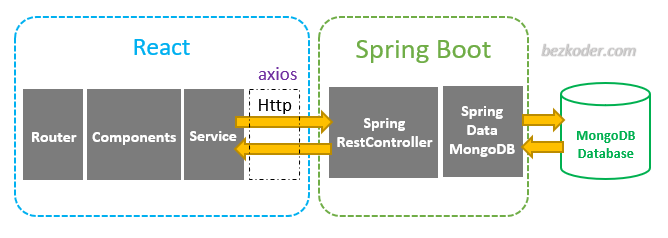

# spring-tutorial-microservice


## Project Overview :globe_with_meridians:	
In this project we will create 2 microservices with a aggregator service which combines data from the two microservice and displays it in a meaningful manner. We will be using `spring boot` as our backend and `reactJS` as our frontend.

## Getting Started - Installation :computer:

```
1.  git clone https://github.com/Chabbax/spring-tutorial-microservice.git
2.  mvn spring-boot:run
```

## Prerequisites :white_check_mark:
- [x] Installation of Java 8 or above
- [x] Installation of Maven with path variable added
- [x] MongoDB Compass installed locally on running server in port 27017 (mongodb://localhost:27017)
